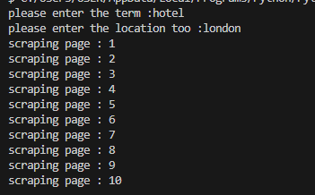
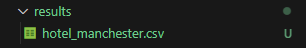

# About
This repository is about my Hands-On experiment to web scraping Using BeautifulSoup4.

For start, you can use hotel term and city in UK for the location.

If success you can see csv will created in results folder

reff : https://www.youtube.com/watch?v=YIiYeyfo7MM
