# Step by step

we will try to scrape https://books.toscrape.com/ ,  so first of all we need to make sure we have granted to access the website.

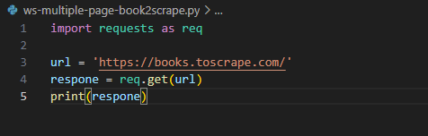

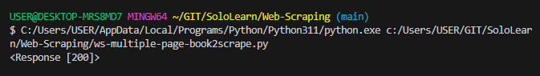

after it we need to check the type of the website so we can parse the website.

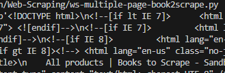

In that picture we know if the website is html.

Next, we need to know where we need to scrape so find the area specific we need to scrape, see this picture for more clearly.

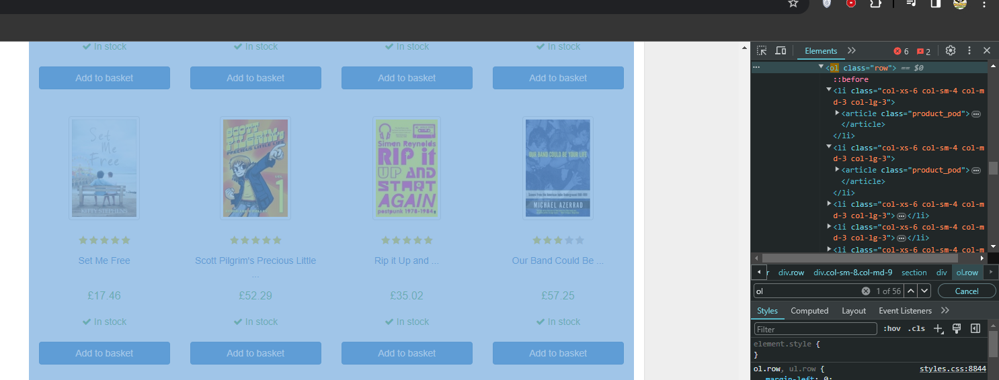

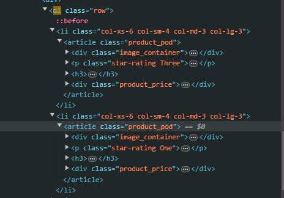

find that text use beautifulsoup

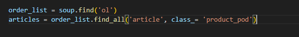

For make sure the area was right, we need to test it.

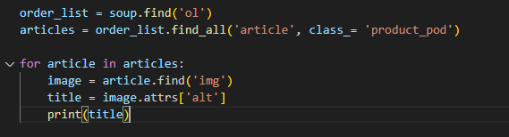

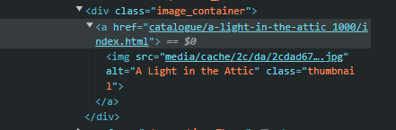

And we get all the title in the page

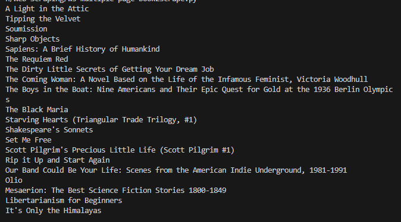

You can do with whatever you wanna take from the website with same method.

To make repetition on each page, we need to change the URL and loop the page at the URL.

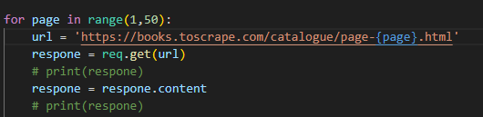

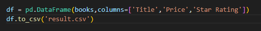

And this is the result

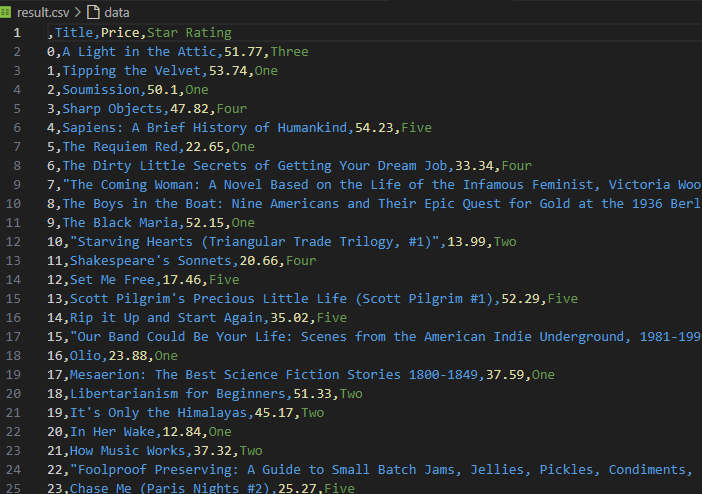